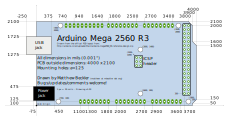
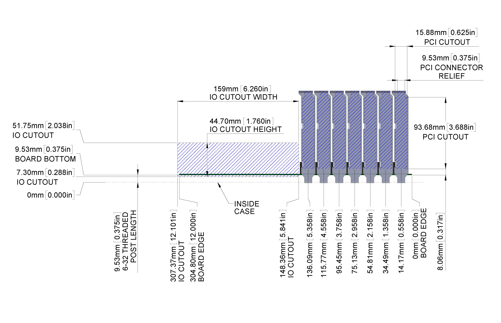

# Laser'd

[Autr's](https://autr.tv) personal repo for keeping organised with laser cutting.

## Links

* [Laserquest](https://autr.github.io/laserquest) - my tool for generating boxes
* [Affinity Designer](https://affinity.serif.com) - for general design (_boo-hiss Adobe_)
* [Inkscape](https://inkscape.org) - for technical things
* [Tinkercad](https://tinkercad.com) - for 3D printed parts
* [Formulor](https://www.formulor.de) - online laser cutting ordering (DE)
* [Lasern](http://www.lasernlasern.de) - Berlin-based (Schoneberg)
* [Will Taylar](https://lasercut-berlin.com) - Berlin-based (Kreuzberg)

## Exporting

Software gets muddled with DPI between file formats. I work with 300DPI in Affinity and use a single XOR compound path when exporting the final EPS/SVG for cutting.

## Measurements

```
# HOLES

RCA = 7mm
Push Button = 12mm, 16mm

------------------------------------

# THREADS

RPI = M2.5 
HDD = M3	
MOBO = M5 / M3
PCI = M3
PSU = M3

------------------------------------

# MOBO

* PCB thickness ~ 1.58mm
* Use 5mm standoffs for MOBO
* 5mm of tabs go into the thickness
* 110.63mm bottom of mobo to top of PCI (USE 110.5)
* 20mm needed for copper GPU pokiness
	-> 130mm / 20mm
	-> OR -> 140mm / 30mm
	-> OR -> 150mm / 40mm


Distance from flat plane of bottom acrylic to top of PCI wedge acrylic = 120mm
120 + ( 20 or 15 or 0 )  + 5 + 5 + 5 = 155 or 150 or 135
160 - 20 = 145 - 120 - = 20
120 + 10 = 130 / 140

------------------------------------

# SIZES

SPLITTER = 96x80x21mm
PSU	Fan = 120x120mm
CPU	Fan = 80x80mm
PSU = 86mm

------------------------------------

# PCI TABS

* 9.53 sticks from bottom of MOBO
* 9.53mm is size of thin end tab
* tab width is 1.14mm
* 14.17mm from bottom edge, then;
* 20.32mm across each

Bottom of board to top of PCI = 110.63mm
Stand-offs = 110.64 + MOBO standoff (6mm?)

```

## Files

__V1__ - `1 x 790x384mm`

* 1 x fullsize ATX case (too thick, ugly)
* 2 x speaker box-cases

_Price ~ 40eu_

__V2__ - `2 x 790x384mm`

* 1 x fullsize ATX case
* 2 x micro ITX case
* 1 x midi controller case
* 2 x pi 3/4 box-case
* 2 x pi zero box-case
* 1 x pi 3/4 case
* 2 x pi zero case
* 35 x M2.5 washers
* 28 x M3 washers
* 3 x hattifatteners

_Price ~ 150eu_

## Notes

Hard to gauge what price will be - seems to be based on amount of lines and time-taken, so slotted box cases are expensive, ie

```
46 x M3/M2.5 washers = 92 small circles = 5eu
```

## Images

[comment]: <> (replaceme)








